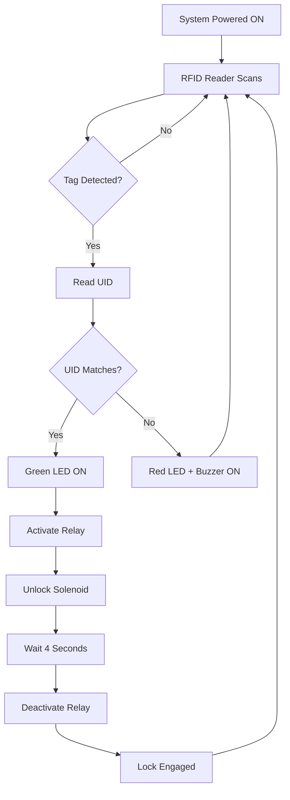

# 🔐 RFID-Based Smart Lock System


> **A contactless, secure, and intelligent door lock system using RFID technology and Arduino UNO**

<div align="center">
  
  ### 🎯 Replace traditional keys with smart, contactless access control
  
  [Features](#-features) • [Components](#-hardware-components) • [Installation](#-installation) • [Usage](#-usage) • [Demo](#-demonstration)
  
</div>

---

## 📖 Overview

This project presents a modern alternative to traditional mechanical locks by implementing **RFID (Radio Frequency Identification)** technology for secure access control. Designed as part of the IDEA Lab experiential learning initiative at RV College of Engineering, this system eliminates vulnerabilities like key loss, duplication, and lock-picking while providing a foundation for IoT-enabled smart security solutions.

### 🌟 Why This Project?

- ✅ **Enhanced Security** - No physical keys to lose or duplicate
- ✅ **Contactless Access** - Touch-free operation with RFID tags
- ✅ **Cost-Effective** - Built with affordable, easily available components
- ✅ **Educational Value** - Hands-on learning in embedded systems
- ✅ **Scalable Design** - Easy to upgrade with IoT, biometrics, or mobile apps

---

## ✨ Features

### Core Functionality
- 🔓 **Instant Access Control** - Response time under 1 second
- 🎯 **Tag Authentication** - Unique UID verification for each RFID tag
- 🔒 **Automatic Locking** - Auto-locks after 4 seconds
- 🔋 **Battery Powered** - Portable operation with rechargeable 18650 cells
- 🔌 **USB Rechargeable** - Built-in TP4056 charging module

### Smart Indicators
- 💚 **Green LED** - Access granted indicator
- 🔴 **Red LED** - Access denied indicator
- 🔊 **Audible Buzzer** - Sound alerts for unauthorized attempts
- ⚡ **Relay Click Feedback** - Physical confirmation of lock activation

### Safety Features
- 🛡️ **Voltage Regulation** - Stable 5V supply with 7805 regulator
- 🔋 **Power Management** - MT3608 booster maintains voltage levels
- 🔐 **Secure UID Storage** - Authorized tags stored in Arduino memory

---

## 🛠️ Hardware Components

| Component | Specification | Purpose |
|-----------|---------------|---------|
| **Microcontroller** | Arduino UNO | Main controller and logic processor |
| **RFID Module** | RC522 (13.56 MHz) | Tag reading and authentication |
| **Actuator** | Solenoid Door Lock | Electromagnetic locking mechanism |
| **Switch Module** | 5V Relay Module | High-current switching for lock |
| **Alert System** | Buzzer + LEDs | Visual and audible feedback |
| **Power Supply** | 3× 18650 Batteries | Rechargeable power source |
| **Voltage Regulator** | 7805 IC | Stable 5V output |
| **Boost Converter** | MT3608 | Maintains voltage levels |
| **Charging Module** | TP4056 | USB-based battery charging |
| **RFID Tags** | 13.56 MHz Cards | Access credentials |

### 💰 Total Project Cost: ₹1,494

<details>
<summary>📋 View Complete Bill of Materials</summary>

| S.No | Component | Cost (₹) |
|------|-----------|----------|
| 1 | Arduino UNO | 400 |
| 2 | RC522 RFID Module + Tag | 150 |
| 3 | Relay Module | 60 |
| 4 | Solenoid Door Lock | 300 |
| 5 | Buzzer | 20 |
| 6 | LEDs | 10 |
| 7 | Resistors (1K ohm) | 2 |
| 8 | 1N4007 Diode | 2 |
| 9 | 7805 Voltage Regulator | 10 |
| 10 | MT3608 Boost Converter | 50 |
| 11 | TP4056 Charging Module | 40 |
| 12 | 18650 Batteries (3×) | 300 |
| 13 | 3-Cell Battery Holder | 40 |
| 14 | Switch | 10 |
| 15 | Jumper Wires | 50 |
| 16 | Enclosure Materials | 50 |

</details>

---

## 🔌 Pin Configuration

### RC522 RFID Module → Arduino UNO
```
SDA  → D10
SCK  → D13
MOSI → D11
MISO → D12
RST  → D9
3.3V → 3.3V
GND  → GND
```

### Other Connections
```
Relay Module:
  VCC → 5V
  GND → GND
  IN  → D3

Buzzer:
  (+) → D2
  (-) → GND

Green LED:
  Anode   → D5 (via 1K resistor)
  Cathode → GND

Red LED:
  Anode   → D4 (via 1K resistor)
  Cathode → GND
```

---

## 🚀 Installation

### Prerequisites
- Arduino IDE (v1.8.x or higher)
- MFRC522 Library
- USB cable for programming

### Setup Instructions

1. **Clone the Repository**
   ```bash
   git clone https://github.com/Aayu2810/Real-Time-Soil-Detector.git
   cd Real-Time-Soil-Detector
   ```

2. **Install Arduino Libraries**
   - Open Arduino IDE
   - Go to **Sketch → Include Library → Manage Libraries**
   - Search and install: `MFRC522`

3. **Hardware Assembly**
   - Connect components as per the pin configuration
   - Ensure proper polarity for LEDs, buzzer, and power connections
   - Double-check relay and solenoid wiring

4. **Upload Code**
   - Open `RFID_Smart_Lock.ino` in Arduino IDE
   - Select **Board: Arduino UNO**
   - Select correct **Port**
   - Click **Upload**

5. **Register RFID Tags**
   - Open Serial Monitor (9600 baud)
   - Scan your RFID tag to get its UID
   - Copy the UID and update it in the code:
     ```cpp
     String authorizedUID = "XX XX XX XX"; // Replace with your UID
     ```
   - Re-upload the code

---

## 💻 Usage

### Operating the System

1. **Power ON**
   - Toggle the master switch
   - Green LED blinks briefly (system ready)

2. **Access Granted**
   - Bring authorized RFID tag near reader (2-5 cm)
   - Green LED lights up
   - Relay clicks and solenoid unlocks
   - Door unlocks for 4 seconds
   - Auto-locks after timeout

3. **Access Denied**
   - Unauthorized tag detected
   - Red LED + Buzzer activate
   - Lock remains engaged

4. **Recharging**
   - Connect USB cable to TP4056 module
   - Charging indicator LED shows status
   - Fully charges in 3-4 hours

---

## 📊 Demonstration

### System Architecture
```
┌─────────────┐      ┌──────────────┐      ┌─────────────┐
│ RFID Tag    │ ───→ │ RC522 Reader │ ───→ │ Arduino UNO │
└─────────────┘      └──────────────┘      └──────┬──────┘
                                                   │
                          ┌────────────────────────┼────────────────┐
                          ↓                        ↓                ↓
                    ┌─────────┐            ┌──────────┐     ┌────────┐
                    │ Relay   │            │ Buzzer + │     │ Status │
                    │ Module  │            │   LEDs   │     │  LEDs  │
                    └────┬────┘            └──────────┘     └────────┘
                         │
                    ┌────▼─────┐
                    │ Solenoid │
                    │   Lock   │
                    └──────────┘
```

### Working Flow


---

## 🧪 Testing Results

### Performance Metrics
- ✅ **Response Time**: < 1 second
- ✅ **Read Range**: 2-5 cm
- ✅ **Success Rate**: 100% in 50 trials
- ✅ **Battery Life**: 8-12 hours continuous operation
- ✅ **Charging Time**: 3-4 hours

### Test Scenarios
| Test Case | Expected Result | Status |
|-----------|----------------|--------|
| Authorized Tag | Unlock + Green LED | ✅ Pass |
| Unauthorized Tag | Lock + Red LED + Buzzer | ✅ Pass |
| No Tag | No Response | ✅ Pass |
| Power Interruption | State Maintained | ✅ Pass |
| Multiple Rapid Scans | Proper Debouncing | ✅ Pass |

---

## 🔮 Future Enhancements

### Planned Features
- 🌐 **IoT Integration** - ESP8266/ESP32 for remote control
- 📱 **Mobile App** - Android/iOS app for access management
- 👆 **Biometric Module** - Fingerprint sensor for dual authentication
- 📝 **Access Logging** - EEPROM/Cloud storage for entry records
- 🤖 **AI Integration** - Behavioral pattern recognition
- ⚡ **Solar Power** - Solar panel + battery backup
- 📧 **Email Alerts** - GSM module for real-time notifications
- 🎨 **Professional Enclosure** - 3D printed weatherproof case

---

## 🏆 Project Team

**RV College of Engineering - Department of ISE**

| Name | Roll Number | Role |
|------|-------------|------|
| Aamani Jha | 1RV24IS002 | Hardware Integration |
| Aayushi Priya | 1RV24IS005 | Software Development |
| Eshita Sahu | 1RV24IS036 | Testing & Documentation |

**Guide:** Prof. Keshavamurthy Y.C., Department of Mechanical Engineering

**Academic Year:** 2024-2025

---

## 📚 References

1. T.S. Rappaport, *RFID and Contactless Technology Basics*, Wiley, 2022
2. A. Sharma, "Arduino Projects for Beginners," *International Journal of Embedded Systems*, vol. 12, pp. 45-52, 2023
3. M. Patel, "Smart Security Systems using RFID and IoT," *Journal of Emerging Technology*, vol. 18, no. 3, pp. 98-104, 2023
4. Arduino Official Documentation: [docs.arduino.cc](https://docs.arduino.cc)
5. RC522 RFID Module Datasheet: [components101.com](https://components101.com/rfid-rc522-module)

---

## 📄 License

This project is licensed under the MIT License - see the [LICENSE](LICENSE) file for details.

---

## 🤝 Contributing

Contributions are welcome! Please feel free to submit a Pull Request.

1. Fork the repository
2. Create your feature branch (`git checkout -b feature/AmazingFeature`)
3. Commit your changes (`git commit -m 'Add some AmazingFeature'`)
4. Push to the branch (`git push origin feature/AmazingFeature`)
5. Open a Pull Request

---

## 📧 Contact

**Aayushi Priya** - [@Aayu2810](https://github.com/Aayu2810)

**Project Link:** [https://github.com/Aayu2810/Real-Time-Soil-Detector](https://github.com/Aayu2810/Real-Time-Soil-Detector)

**Institution:** RV College of Engineering, Bengaluru - 560059

---

<div align="center">

### ⭐ If you found this project helpful, please give it a star!

**Made with ❤️ by Aayushi Priya | RV College of Engineering**

</div>
